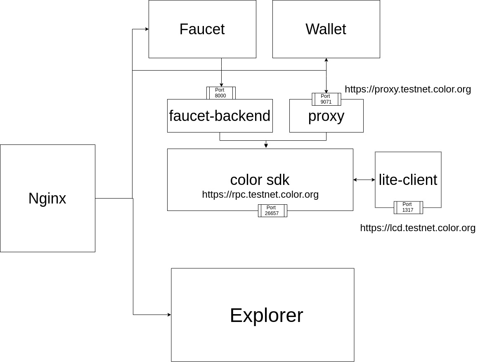

# Configration Guidelines Docker Base





## 1. Setup Color Nodes

To setup color nodes, clone the code from color platform
```
https://github.com/ColorPlatform/color-sdk

```
run the following commnad to start nodes 
```
make install
make build
make build-docker-colordnode
docker-compose up
```


## 2. Setup lite client

Run the following command to start lite client 
```
colorcli rest-server --chain-id=colors-test-01     --laddr=tcp://0.0.0.0:1317     --node tcp://localhost:26657     --trust-node=false --home node1/colorcli

```
you can set path to any node 

e.g --home node1/colorcli


## 3. Setup Explorer

### Prerequisite
1. Install nodejs v11.15.0
2. Install Meteor 
3. Install Yarn


### Setup the mongo db using the collowing commands

```
sudo apt update

sudo apt install -y mongodb

sudo systemctl status mongodb
```
Create User on mongo db
Type following in side mongodb
```

db.createUser(
   {
      user: "username",
      pwd: "password",
      roles: [ { role: "readWrite", db: "colorplatform" } ]
   }
);
```

### Mannual Method

Clone the project from color platform

```
git clone https://github.com/RNSSolution/explorer.git

```

run following commnad to genrate build

```
sh build.sh
cd bundle/programs/server/
npm install
cd ~/explorer/bundle
```


run the following command to start explorer
```
PORT=3000 ROOT_URL=http://localhost/ MONGO_URL='mongodb://{username}:{password}@{IP}:27017/colorplatform' METEOR_SETTINGS="$(cat settings.json)" meteor node main.js
```


### Setup explorer using Docker

To Get genesis file run the follwing command
```
https://raw.githubusercontent.com/ColorPlatform/explorer/colorsplatform/development/settings.json
```
To run the docker 
```
docker run -d -p 3000:3000  -e MONGO_URL=mongodb://{username}:{password}@{IP}:27017/colorplatform -e METEOR_SETTINGS="$(cat settings.json)" --name explorer rnssolutions/explorer:0.1.5
```


## 4. Setup Wallet

### Lite Proxy

clone the lite-proxy

```
git clone https://github.com/ColorPlatform/lite-proxy.git
cd lite-proxy
```
install the certificated 
```
yarn install
yarn certificates
```
To run the proxy

```
yarn proxy
```

By default it will run on ```https://lcd.testnet.color-platform.rnssol.com```

to change this update value of target in proxy.js


### Wallet URL shortner

To Setup url shortner clone the code

```
git clone https://github.com/ColorPlatform/url-shortner.git
cd url-shortner
docker-compose up
```

### Wallet Docker Container

Type the following command in terminal to run front end of wallet

```
docker run -p 9080:9080 -d rnssolutions/colorwallet:1.0.4

```

### Wallet Mannul Method

clone the code from color platform 
```
https://github.com/ColorPlatform/faucet-backend.git
```

run following command by update the endpoint url 

```
 QRCODE=https://wallet.testnet.color-platform.org FAUCET=https://proxy.testnet.color-platform.org:8010/claim/wallet SHORTURL=https://s.testnet.color-platform.org/encode/ CHAIN=colors-test-01 STARGATE=https://proxy.testnet.color-platform.org:9061 RPC=https://rpc.testnet.color-platform.org yarn build
```

run following commnad to run wallet

```
yarn serve:dist
```


## 5. Setup Faucet

Faucet consist of backed and front end 

### Setup faucet backend


clone the code from color platform


```
git clone https://github.com/ColorPlatform/faucet-backend.git
cd faucet-backend
```

set the configration in .env
set FAUCET_KEY with with address of validator 

set FAUCET_KEY with with address of validator 
set FAUCET_PASS with pass of validator
set FAUCET_CHAIN with faucet chain
set FAUCET_HOME with path to validator cli


a sample configration  is given in the .env file

to run the faucet 
```
./faucet
```

### Setup facuet front end 


run the following command to run faucet front end 

```
 docker run -p 8080:8080 -d rnssolutions/color-faucet-frontend:0.0.9-rc
```

Mannul Method 

clone the code from color platform
```
https://github.com/ColorPlatform/color-faucet-stable.git
```

run the following command to buid the faucet front end
```
 NODE_ENV=production VUE_APP_CHAIN=colors-test-01 VUE_APP_CLAIM_URL=https://proxy.testnet.color-platform.org:8010/claim yarn build
```
update your end point in above command

run following command to run faucet front end
```
yarn serve:dist
```


